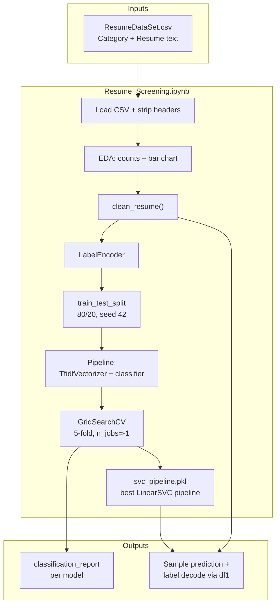
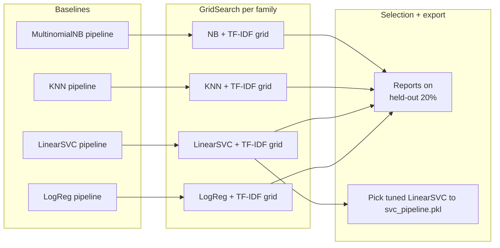
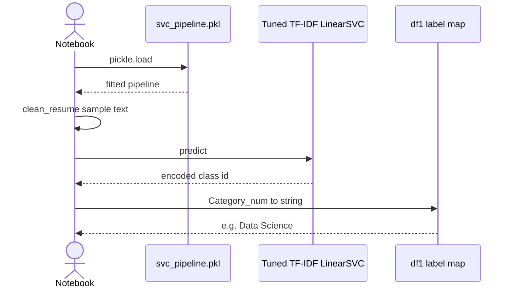

<div align="center">

# Resume screening with text classification

**Classify unstructured resume text into job-role categories using classical NLP and scikit-learn.**

[](LICENSE)
[](https://www.python.org/downloads/)
[](https://scikit-learn.org/)
[](https://jupyter.org/)
[](https://github.com/Vedv7/Resume-Screening-using-Text-classification)
[](https://github.com/Vedv7/Resume-Screening-using-Text-classification/actions/workflows/ci.yml)

**Canonical repository:** [https://github.com/Vedv7/Resume-Screening-using-Text-classification](https://github.com/Vedv7/Resume-Screening-using-Text-classification)

[Executive summary](#executive-summary) · [System architecture](#system-architecture) · [Modeling workflow](#modeling-workflow) · [Inference flow](#inference-flow) · [Features](#features) · [Quick start](#quick-start) · [Results](#results) · [Ethics](#ethics--limitations) · [Levelling up](#levelling-up-this-project) · [Roadmap](#roadmap)

</div>

---

## Table of contents

1. [Overview](#overview)  
2. [Executive summary](#executive-summary)  
3. [System architecture](#system-architecture) (Mermaid)  
4. [Modeling workflow](#modeling-workflow) (Mermaid)  
5. [Inference flow](#inference-flow) (Mermaid)  
6. [Features](#features)  
7. [Repository layout](#repository-layout)  
8. [Quick start](#quick-start)  
9. [Reproducibility and CI](#reproducibility-and-ci)  
10. [What the notebook actually does](#what-the-notebook-actually-does)  
11. [Methodology (summary)](#methodology-summary)  
12. [Results](#results)  
13. [Ethics & limitations](#ethics--limitations)  
14. [Levelling up this project](#levelling-up-this-project)  
15. [Roadmap](#roadmap)  
16. [Tech stack](#tech-stack) · [License](#license) · [Author](#author)

---

## Overview

Recruiters and hiring teams routinely process large volumes of resumes. Manual triage is slow, does not scale, and can be inconsistent. This project is an **end-to-end learning exercise**: raw resume text is cleaned, vectorized with **TF–IDF**, and classified into **25 predefined job categories** (for example Data Science, Python Developer, DevOps Engineer) using **traditional ML** models from scikit-learn.

The work is packaged as a **reproducible Jupyter workflow** so others can inspect every preprocessing and modeling step—not a black-box demo.

All source code and issues for this project live at **[https://github.com/Vedv7/Resume-Screening-using-Text-classification](https://github.com/Vedv7/Resume-Screening-using-Text-classification)** (`Vedv7/Resume-Screening-using-Text-classification`).

---

## Executive summary

| Design goal | How this repo addresses it |
|-------------|------------------------------|
| **Traceability** | **Notebook** for the full multi-model story; **`src/resume_screening/`** for shared `clean_resume` + training helpers used by the **CLI** and **pytest**. |
| **Explainable classical NLP** | TF–IDF + linear / neighborhood / naive Bayes models (no opaque LLM core). |
| **Fair comparison** | Shared 80/20 split (`random_state=42`) and `classification_report` for each algorithm. |
| **Tuning discipline** | `GridSearchCV` (5-fold) jointly over vectorizer and classifier hyperparameters. |

**Short GitHub “About” line (copy-paste):**  
Multiclass resume categorization (25 roles) with sklearn pipelines, TF–IDF, GridSearchCV, and a serializable LinearSVC artifact—full story in `Resume_Screening.ipynb`.

---

## System architecture

High-level components: CSV on disk, **importable package** (`resume_screening`), Jupyter narrative, **joblib** bundle from `resume-train`, optional **`resume-predict`**.

> Notebook cleaning step: `from resume_screening.cleaning import clean_resume` (requires `pip install -e .` first).



---

## Modeling workflow

Baselines (default hyperparameters) run first; then each family gets a joint TF–IDF + classifier grid search; the exported artifact is the **best** LinearSVC estimator from grid search.



---

## Inference flow

How the notebook demo path uses the saved pipeline (after training cells have run).



---

## Features

| Area | What you get |
|------|----------------|
| **Data** | Labeled resume text paired with job category (`ResumeDataSet.csv`). |
| **Notebook** | Full pipeline: cleaning, TF–IDF, train/test split, multiple models, hyperparameter search. |
| **Dependencies** | Pinned ranges in `requirements.txt` for reproducible installs. |
| **Governance** | MIT `LICENSE`, contribution guidelines, **GitHub Actions CI** (`pytest` + `compileall` + CLI smoke), security note. |

---

## Repository layout

```
.
├── .github/workflows/ci.yml
├── CITATION.cff
├── CONTRIBUTING.md
├── LICENSE
├── README.md
├── SECURITY.md
├── models/                 # default output for resume-train (.gitkeep only; *.joblib gitignored)
├── pyproject.toml          # package metadata, optional [dev], [notebook], console scripts
├── requirements.txt        # minimal pip set; editable install preferred (see Quick start)
├── ResumeDataSet.csv
├── Resume_Screening.ipynb
├── src/resume_screening/   # installable package (cleaning, io, train, cli)
│   ├── __init__.py
│   ├── cleaning.py
│   ├── cli.py
│   ├── io.py
│   └── train.py
└── tests/                  # pytest (cleaning + quick train smoke on CSV subset)
```

The **notebook** remains the full teaching artifact (all four model families). The **package** holds the canonical `clean_resume`, training/save helpers, and **`resume-train` / `resume-predict`** entry points so CI and scripts do not fork the logic.

---

## Quick start

### Prerequisites

- **Python 3.10+** (3.11 recommended)
- `pip` and `git`

### Clone and install (recommended: editable package + dev + notebook extras)

```bash
git clone https://github.com/Vedv7/Resume-Screening-using-Text-classification.git
cd Resume-Screening-using-Text-classification

python -m venv .venv
# Windows
.venv\Scripts\activate
# macOS / Linux
# source .venv/bin/activate

pip install --upgrade pip
pip install -e ".[dev,notebook]"
```

Minimal install (no Jupyter in the env): `pip install -e ".[dev]"` or `pip install -r requirements.txt` plus `pip install -e .`.

### Train and predict from the CLI

```bash
# Full grid (slower): writes models/resume_linear_svc.joblib
resume-train --data ResumeDataSet.csv --out models/resume_linear_svc.joblib

# Fast smoke (smaller grid, 3-fold CV)
resume-train --quick --data ResumeDataSet.csv --out models/resume_linear_svc.joblib

resume-predict --model models/resume_linear_svc.joblib --text "Python pandas scikit-learn NLP machine learning"
# or: resume-predict --model models/resume_linear_svc.joblib --file sample_resume.txt
```

The joblib bundle stores the **fitted pipeline**, **`LabelEncoder`**, and basic **metadata** (held-out accuracy, best params).

### Run the notebook

```bash
jupyter notebook Resume_Screening.ipynb
```

Execute cells from top to bottom. Keep `ResumeDataSet.csv` next to the notebook. The cleaning cell imports **`clean_resume` from `resume_screening`**, so the editable install step above is required.

---

## Reproducibility and CI

[`.github/workflows/ci.yml`](.github/workflows/ci.yml) runs on pushes and pull requests to `main` / `master`:

1. `pip install -e ".[dev]"`  
2. `python -m compileall -q src tests`  
3. `pytest` (cleaning unit tests + **quick** train smoke on the first 400 rows of `ResumeDataSet.csv`)  
4. **`resume-train --quick --max-rows 350`** then **`resume-predict`** on a short string  

The full notebook is **not** executed in CI (runtime + output size); run it locally after `pip install -e ".[notebook]"`.

---

## What the notebook actually does

Verified against the checked-in `Resume_Screening.ipynb` (not hand-waved in prose).

1. **Load data** — `pandas.read_csv('ResumeDataSet.csv')`, then `df.columns = df.columns.str.strip()` so headers stay consistent. The dataframe has two columns, **`Category`** (string label) and **`Resume`** (raw text). `df.shape` is **(962, 2)** in the saved outputs.
2. **EDA** — per-class counts via `value_counts`, printed table, and a **Seaborn** bar plot of resumes per category (25 categories).
3. **`clean_resume(text)`** — implemented in **`resume_screening.cleaning`** (imported in the notebook); lowercase, mojibake / bullet fixes, strip URLs, drop digits, keep letters + spaces, normalize whitespace.
4. **Targets** — `LabelEncoder` on `Category`. A copy **`df1`** keeps original string labels plus **`Category_num`** for decoding predictions at the end; **`df['Category']`** is overwritten with encoded integers for modeling.
5. **Split** — `train_test_split(..., test_size=0.2, random_state=42)` on resume text `X` and encoded `y` (about **193** test samples in the logged classification reports).
6. **Models** — each classifier uses a **`Pipeline([TfidfVectorizer(), classifier])`**. **GridSearchCV** (`cv=5`, `n_jobs=-1`) tunes **`tfidf__max_features`** ∈ {1000, 2000, 3000}, **`tfidf__ngram_range`** ∈ {(1,1), (1,2)}, and classifier-specific grids:
   - **LogisticRegression:** `C` ∈ {0.1, 1, 10}, `penalty` fixed to `'l2'`.
   - **LinearSVC:** `C` ∈ {0.1, 1, 10}.
   - **KNeighborsClassifier:** `n_neighbors` ∈ {3, 5, 7}, `weights` ∈ {`'uniform'`, `'distance'`}.
   - **MultinomialNB:** `alpha` ∈ {0.1, 0.5, 1.0}.
7. **Baselines before tuning** — default-hyperparameter **LogisticRegression**, **LinearSVC**, **KNN** (`n_neighbors=3`), and **MultinomialNB** with `TfidfVectorizer(stop_words='english')` in that one baseline cell.
8. **Artifact** — the notebook writes **`svc_pipeline.pkl`**: it now serializes **`grid_search_svc.best_estimator_`** (tuned TF–IDF + **LinearSVC**), not the untuned `pipeline_svc`.
9. **Demo prediction** — loads the pickle, runs **`clean_resume`** on a long **sample resume** string, predicts the encoded class, then maps back to the human-readable category via **`df1`**.

> **Portfolio hygiene:** The sample-resume cell is realistic enough that you should **replace it with synthetic or fully consented text** before sharing widely, so you are not distributing someone else’s CV details.

---

## Methodology (summary)

| Step | Implementation in code |
|------|-------------------------|
| Dataset | `ResumeDataSet.csv`, 962 rows, 25 `Category` values |
| Cleaning | `resume_screening.cleaning.clean_resume` (notebook imports the same function) |
| Features | TF–IDF inside each sklearn `Pipeline` |
| Tuning | `GridSearchCV` on TF–IDF + classifier jointly |
| Evaluation | `classification_report` on the held-out 20% split |

---

## Results

Numbers below come from **stdout in the committed notebook** (test split, `random_state=42`). Slight drift is possible if you change library versions.

| Model | Test accuracy (notebook output) |
|--------|----------------------------------|
| Logistic Regression (default pipeline) | **0.99** (193 support) |
| Logistic Regression (GridSearchCV best) | Same ballpark; **best CV score ≈ 0.9961** |
| LinearSVC (default pipeline) | **0.99** |
| LinearSVC (GridSearchCV best) | **0.99**; **best CV score ≈ 0.9961** |
| KNN (default `n_neighbors=3`) | **0.98** |
| KNN (GridSearchCV best) | **0.98** |
| MultinomialNB (baseline cell) | **0.99** |
| MultinomialNB (GridSearchCV best) | **0.99** |

**Chosen export model:** tuned **LinearSVC** pipeline (`grid_search_svc.best_estimator_`). Reported **best params** in the notebook output include:

```json
{
  "classifier__C": 0.1,
  "tfidf__max_features": 3000,
  "tfidf__ngram_range": [1, 1]
}
```

> **Why not claim “production-ready”?** Very high accuracy on a fixed public dataset can reflect **data leakage**, **easy separation**, or **distribution shift** versus real applicant traffic. Treat these numbers as **benchmarks on this corpus**, not a guarantee in live hiring.

---

## Ethics & limitations

Automated resume screening can **amplify bias** if training data under-represents groups, if labels encode historical hiring patterns, or if proxies correlate with protected attributes.

**Responsible use:**

- Do not use this repository as a sole hiring decision system.  
- Audit performance across **demographic and linguistic** slices if you ever adapt it to real data.  
- Comply with **employment law** and **privacy** obligations in your jurisdiction (consent, retention, explainability expectations).  

**Technical limitations of this baseline:**

- **Bag-of-words** models miss long-range context and subtle semantics compared to modern embeddings or LLMs.  
- **English-centric** cleaning may hurt multilingual resumes.  
- **Category definitions** are fixed; real organizations need ontology design and human-in-the-loop review.  

---

## Levelling up this project

Ideas that mirror a “production-shaped” portfolio repo (similar spirit to [Predicting-flight-rates-through-advanced-regrression](https://github.com/Vedv7/Predicting-flight-rates-through-advanced-regrression)): small package, CLI, CI, and docs—not more notebook-only complexity.

| Priority | Item |
|----------|------|
| **P1** | **Done — `src/resume_screening/`:** `clean_resume`, `train_from_csv`, `io`, `cli`. |
| **P1** | **Done — CLI:** `resume-train`, `resume-predict` (see Quick start). |
| **P1** | **Done — CI:** `.github/workflows/ci.yml` (`compileall`, `pytest`, CLI smoke). |
| **P2** | **Done — packaging:** `pyproject.toml`, `pip install -e ".[dev,notebook]"`. |
| **P2** | **FastAPI** — `POST /predict` with request body `{"resume": "..."}` returning top-1 and optional **top-k probabilities** (calibrated LR or `predict_proba` where available). |
| **P2** | **Richer evaluation** — confusion matrix heatmap, per-class F1, **macro vs weighted** averages, error analysis notebook. |
| **P2** | **`nbstripout` / pre-commit** — keep committed notebooks smaller; clear outputs before push or strip in CI. |
| **P3** | **Embeddings** — sentence-transformers baseline vs TF–IDF on a held-out slice. |
| **P3** | **Streamlit** — upload PDF/TXT, show predicted category + attention-style keyword highlights (simple TF–IDF coefs). |
| **P3** | **Dockerfile** — one-command demo API for recruiters / reviewers. |

### Still worth adding next (portfolio polish)

- **Makefile** or **`nox`** — one-liners for `lint`, `test`, `train-quick`.  
- **Ruff + pre-commit** — consistent style; optional **`mypy`** on `src/`.  
- **`[api]` extra** in `pyproject.toml` + **FastAPI** app loading the same joblib bundle (mirror your flight repo’s `api/` pattern).  
- **Data card** (`docs/DATA.md` or Kaggle link) — provenance and license for `ResumeDataSet.csv`.  
- **Release tags** — attach a trained `.joblib` as a **GitHub Release asset** (optional; keep PII out).  
- **Confusion matrix + per-class F1** in the notebook or a `reports/` figure saved from CI artifact.

## Roadmap

- [x] Notebook loads **`ResumeDataSet.csv`**; **`svc_pipeline.pkl`** stores **`grid_search_svc.best_estimator_`** (tuned LinearSVC)  
- [x] **`src/resume_screening/`** package with **`clean_resume`**, **`train_from_csv`**, **`resume-train` / `resume-predict`**, **`pytest`**, **GitHub Actions CI**  
- [x] Notebook cleaning cell imports **`resume_screening.cleaning`** (after `pip install -e .`)  
- [x] **`pyproject.toml`** with `[dev]` and `[notebook]` optional dependencies  
- [ ] **FastAPI** — `POST /predict` using the same joblib bundle  
- [ ] Experiment tracking (e.g. MLflow or Weights & Biases) for hyperparameter runs  
- [ ] Stronger evaluation: confusion matrix, calibration, error analysis notebook  
- [ ] **`nbstripout` / pre-commit** to keep notebook outputs out of git  

Contributions welcome—see [CONTRIBUTING.md](CONTRIBUTING.md).

---

## Tech stack

- **Python** · **pandas** · **NumPy** · **joblib**  
- **scikit-learn** (pipelines, TF–IDF, GridSearchCV, classifiers)  
- **pytest** (dev) · **setuptools** (editable install)  
- **Matplotlib** / **Seaborn** (notebook extra `[notebook]`)  
- **Jupyter** for the full multi-model narrative (notebook metadata: **Python 3.11.x**)  

---

## License

This project is released under the [MIT License](LICENSE). You may use, modify, and distribute the code with attribution, subject to the license text.

---

## Author

**Veda Swaroop**  
Applied ML · NLP · recruitment analytics  

If this project helped you, a star on the [GitHub repo](https://github.com/Vedv7/Resume-Screening-using-Text-classification) helps visibility.

---

## Acknowledgments

Dataset: public resume classification corpus bundled as `ResumeDataSet.csv` in this repository (962 labeled documents, 25 categories). Cite or link the original source if you republish derivatives, per that source’s terms.
